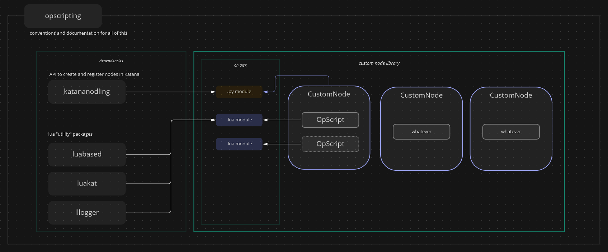

# Index

[](../README.md)
[](INDEX.md)

Welcome on the `opscripting` package documentation.

# What

`opscripting` is a "proof of concept" that we can have a better OpScript
workflow in a pipelined environment.

In my opinion, OpScript code should not live in the scene, and should only
import code stored in the pipeline arborescence.

This package offers the tools to get started on that road, but would deserve to
be a bit modified if actually used in a studio pipeline.

Right now all depencies and packages are regrouped under this single repo for
conveniency. But it made sense that in a pipeline, this repo wouldn't exist (
or would just be for the `opscriptlibrary`) and would be just split across
multiples places, combined at runtime.

Nevertheless, you could totally directly use this repo.

If things are not clear, here is a diagram



# Install

> **Note**
> You can check [../dev/launcher.Katana...sh](../dev/launcher.Katana-4.5.1.sh) to see some
> launcher examples that resume all the under.

This will explain how to register all the dependencies and the `opscriptlibrary`.

Assuming we have this hierarchy to starts with :

```ini
z/stuff/
    opscripting/
        README.md
        opscriptlibrary/
        ...
```

1. Add the repo root directory to the `PYTHONPATH` env variable.

```shell
export PYTHONPATH="z/stuff/opscripting"
# where opscripting/ contains `README.md`, ...
```

This will allow `opscriptlibrary` to be registered for python.

2. Add the repo root directory to the `LUA_PATH` env variable.

```shell
export LUA_PATH="z/stuff/opscripting/?.lua"
# where opscripting/ contains `README.md`, ...
```

This will allow `opscriptlibrary` to be registered for lua.

If you are familiar with the LUA module syntax, this means that all the
lua modules will be accessible from the `opscriptlibrary` namespace.

3. Register the dependencies

```shell
export PYTHONPATH=$PYTHONPATH:'z/stuff/opscripting/katananodling'

export LUA_PATH=$LUA_PATH:'z/stuff/opscripting/luabased/?.lua'
export LUA_PATH=$LUA_PATH:'z/stuff/opscripting/luakat/?.lua'
export LUA_PATH=$LUA_PATH:'z/stuff/opscripting/lllogger/?.lua'
```

> **Warning** Be aware that those dependencies might also have dependencies.
> For example `katananodling` need the python `typing` module. 


## Registering node libraries

For the artist to access the created nodes, you need to register them in Katana.

### 1. Registering nodes

For this you will just need to run during Katana the `registerNodesFor` function
that expect a list of python package names as argument. Those package
must be already registered in the PYTHONPATH, so they can be imported.

```python
from katananodling.loader import registerNodesFor

# make sure "opscriptlibrary" parent dir is in the PYTHONPATH
locations_to_register = ["opscriptlibrary"]

registerNodesFor(locations_to_register)
```

Make sure this is only executed once AND in gui and headless mode. I personally
put them in a `Startup/init.py` file registered in `KATANA_RESOURCES`.

### 2. Registering the layeredMenu

The nodes are accessible via the usual `Tab` shortcut, but they will be 
drowned among the other nodes. To find the CustomNodes quicker, there is a 
pre-made layeredMenu available that you can register :

```python
from Katana import LayeredMenuAPI
import katananodling.menu

layered_menu = katananodling.menu.getLayeredMenuForAllCustomNodes()
LayeredMenuAPI.RegisterLayeredMenu(layered_menu, "katananodling")
```

There is a demo in [../dev/KatanaResources/UIPlugins](../dev/KatanaResources/UIPlugins).
(you can add [../dev/KatanaResources](../dev/KatanaResources) to the `KATANA_RESOURCES` variable.)

# Create a new OpScriptCustomNode

The [documentation of katananodling](../katananodling/doc/INDEX.md) explain a good
bunch of what you need to know, so please read it first.

There is just a few minor changes for our OpScript workflow.

## hierarchy

First I think it is really important to respect the convention one custom-node = one module.
Because each module will also have an associated lua module :

```shell
opscriptlibrary/
    __init__.py
    nodeAlpha.lua 
    nodeAlpha.py
    nodeBeta.lua 
    nodeBeta.py
```

To get things even cleaner, I would even recommend to use python packages :

```shell
opscriptlibrary/
    __init__.py
    nodeAlpha/
        __init__.py
        init.lua 
    nodeBeta/
        __init__.py
        init.lua 
```

So if you have a pretty big documentation to write, or even multiple lua modules
to use. The library doesn't become complete chaos.

To avoid having too much modules we just defined the node in the `__init__.py`,
same goes for the lua script even if it doesn't work the same way as python.


## naming-conventons

The first task will be to determine the name for your node. It will be used
to name the files and access them. Try to think of something unique because
you really don't want duplicates in your node library.

You have a name you will have to "slugify" it, so you can use it in file names.
On my side I decided to stick to the `snake_case` conventions.

ex with `Tree generator`:
- module name: `tree_generator`
- class name: `TreeGeneratorNode`
- BaseCustomNode.name : `TreeGenerator`


## node class

Then instead of inheriting our node class from `BaseCustomNode` we will be using
`OpScriptCustomNode` that will remove repetitive task we would have to do if
using the base class.

```python
from katananodling.entities import OpScriptCustomNode

# class can actually be named anything but its name is used as identifier
# so don't change it later.
class MyNodeName(OpScriptCustomNode):
    name = "MyNodeName"  # identifier used to register the tool in Katana !
    version = (0, 1, 0)
    color = OpScriptCustomNode.Colors.blue
    description = "What the node does in a few words."
    author = "<FirstName Name email@provider.com>"

    def _build(self):
        script = 'local module = require("{path}")\nmodule.run()'
        script = script.format(path=self.getLuaModuleName())
        node = self.getDefaultOpScriptNode()
        
        node.getParameter("script.lua").setValue(script, 0)
        return

```

Having a proper hierarchy allow us to use `getLuaModuleName()` which will
find the name of the lua module to use for this node by itself.

# Lua Use

To import a module, use the [`require`](https://www.lua.org/pil/8.1.html) function.

## Lua in the OpScript node itself

No code should be found in the OpScript node. It should only import and
execute what it needs.

This means we need to store the lua code on disk in a file. The proposed 
convention is to store those file in a directory that will be registered in
the LUA_PATH.

```shell
opscriptlibrary/  <- # parent directory registered in LUA_PATH   
    my_script.lua
```

You can then use it as such in the OpScript :

```lua
local module = require("opscriptlibrary.my_script")
module.run()  -- depends what your module returns
```

Make sure to check what the lua script is returning. The standard will be to return
a "module" table with a run function but it might be something else.

## Lua module for the OpScriptCustomNode

This file will drive how we will build the node in python later, mainly for
its `oparg` that must be implemented as user parameters on the OpScript node,
but also because it might require to use some other nodes before/after the OpScript.
So it's a good idea to start by it.

As mentioned previously, the `.lua` file (or even the lua "package") will live 
alongside the python module for the node.

You can do whatever you want inside, but to let's define standard to uniform things.
The module MUST always return a table that CAN have a function named `run` as
main function.

The table module is named `_M_` and is always at the top-most of the file

```lua
-- opscriptlibrary/attr_math.lua
local _M_ = {}

function _M_.run()
  -- do something
end

return _M_
```

So then in the OpScript it can be imported as :

```lua
local module = require("opscriptlibrary.attr_math")  -- return run function
module.run()
```


### Importing other lua modules

In the OpScript script file you created as mentioned above, you might also
want to import other modules to reduce duplicated code.

This package offers 2 lua package `luabased`, `luakat` as a base to create OpScripts.

Here is how you import them :

```lua
local luabased = require("luabased")
local luakat = require("luakat")
```
