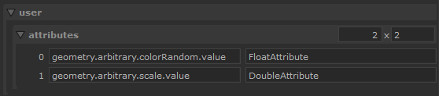

# AttrTypeSwap

Quickly change the data type used on an attribute for another one.

# Features

- Support the use of multiple time samples for the source attribute. (motion-blur).
- 2 method available for attribute processing.

# Config

First set the scene-graph location where you want to modify some of its attributes
in the `location` parameter at top.

You can then modify the `user.attributes` parameter to add attribute to modify.
Each row corresponds to an attribute to modify where :

- column [1*n] = path of the attribute relative to the location set 
- column [2*n] = new DataAttribute type to use, ex: StringAttribute

Example : 



List of DataAttribute can be found on
[the Katana documentation](https://learn.foundry.com/katana/5.0/dev-guide/OpsAndOpScript/Attributes/OpScript.html#IntAttribute)
but the script supports :

```
IntAttribute,
FloatAttribute
DoubleAttribute
StringAttribute
```

## user.method

which method to use for querying attributes:
- `table` : max of 2^27 (134 million) values per attribute
- `array` _(default)_: a bit slower, no size limit 
