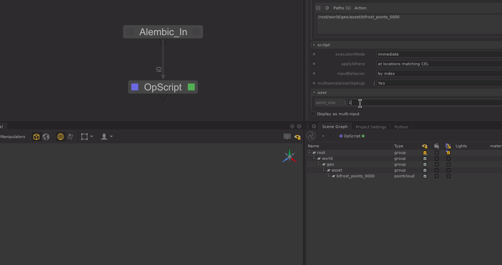

# Point Width

Add a `geometry.point.width` attribute to control the viewer's size of the points
OR scale the existing one.

If no existing atrtribute, act like a size, else act as a scale multiplier.

