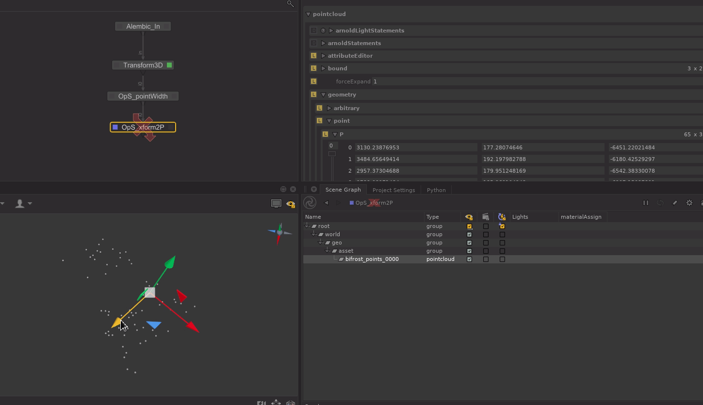

# Xform2P

Merge xform transformations to the `geometry.point.P` attribute.

Supports motion blur.

> **Warning** If your xform transform is interactive, think to disable
> this ops before trying to move it in the viewer.

If the locations matched by the CEL doesn't have a `geometry.point.P` it will yield
an error.

